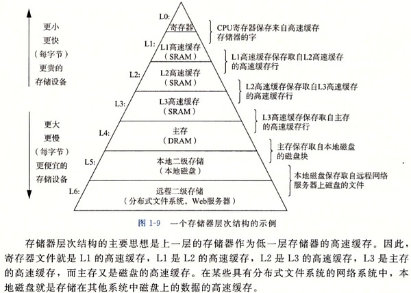
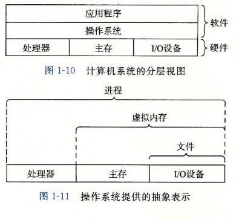

- 第一章 计算机系统漫游


## Chapter 1 A Tour of Computer System
一个对计算机系统总体的介绍，简单明了。

应试 ★★★：可能在笔试中会有一些整体上的概念题。
修炼 ★: 属于计算机最基本的概念。


1.1  编译系统组成


1.2 计算机组成




- - - - - - - - - - - - - - - - - - - - - - - - - - - - - - - - - - - - - - - - - - - - - - - - - - - - - - - - - - - - - - - - - - - - - -
## chapter 2 Representing and Manipulating Information

信息在计算机中的表示形式。分别包括整数和浮点数的表示形式。

应试 ★: 应试中很少会考到。
修炼 ★★★★：不知道浮点数是如何用那4（8）个字节存储的。

整数的表示虽然只能编码一个相对较小的数值范围，但这种表示是精确的；浮点数虽然能编码一个较大的数值范围，但这种表示是近似的。

### 信息存储
- 计算机使用字节(byte, 1byte=8bits)而不是单独的位来作为最小寻址单位。
- 机器级程序将内存视为一个非常大的字节数组，称为虚拟内存。内存的每个字节都由一个唯一的数字来标识，称为它的地址，所有可能的地址的集合就称为虚拟地址空间。
- 虚拟地址空间是一个逻辑上的概念，实际上计算机将动态随机访问存储器(DRAM)、闪存、磁盘存储器、特殊硬件和操作系统软件结合起来，为程序提供一个看上去统一的字节数组。
### 十六进制表示法
由于二进制表示法太冗长，人们常用十六进制表示法，可用值为0-9A-F。人们常以0x开头表示十六进制值。

在十六进制和二进制之间相互转换非常容易，如果给定一个二进制序列要转换为十六进制，只需从低位到高位以4位一组分组，最左边的一组位数若不足4位可以在左边补0。然后将每个4位组直接转换为0-9A-F中的一个值即可。将十六进制转换为二进制就是将每一位以其相应的二进制位串代替即可。

### 字数据大小
字长(word size)指明了指针数据的标称大小，字长决定了虚拟地址空间的最大大小。对于一个字长为w的机器而言，其虚拟地址空间范围为0-2^w-1，程序最多访问2^w个字节。

### 寻址和字节顺序
有两种字节顺序：

- 小端法(little endian)是最低有效字节在最前面。
- 大端法(big endian)是最高有效字节在最前面。

比如一个int类型的变量值为0x01234567，位于地址0x100处，在两种字节顺序下的情况如下：

小端法：

```
... 0x100 0x101 0x102 0x103 ...
      67    45    23    01
```
大端法：

```
... 0x100 0x101 0x102 0x103 ...
      01    23    45    67
```
对于选择哪种字节顺序并没有任何技术上的理由。

### 表示字符串
C语言中的字符串被编码成一个以null(其值为0)字符结尾的字符数组，每个字符都由某个标准编码来表示，如最常见的ASCII字符编码。ASCII字符集适合编码英文文档，如果要支持多语言文字，就需要使用Unicode编码。

### 表示代码
不同机器类型使用不同的且不兼容的指令和编码方式，因此二进制代码是不兼容的。

#### 布尔代数简介

布尔代数的操作符：

- 非：~
- 与：&
- 或：|
- 异或：^

| First Header  | Second Header |
| ------------- | ------------- |
| Content Cell  | Content Cell  |
| Content Cell  | Content Cell  |


|  ~   |      |
| ------------- | ------------- |
|  0   |  1   |
|  1   |  0   |

|  &   |  0   |  1   |
| ------------- | ------------- | ------------- |
|  0   |  0   |  0   |
|  1   |  0   |  1   |

|  1  |  0   |  1   |
| ------------- | ------------- | ------------- |
|  0   |  0   |  1   |
|  1   |  1   |  1   |

|  ^   |  0   |  1   |
| ------------- | ------------- | ------------- |
|  0   |  0   |  1   |
|  1   |  1   |  0   |

布尔代数的一些数学属性：

- 布尔运算&对|的分配律：a&(b|c) 等价于 (a&b)|(a&c)。
- 布尔运算|对&的分配律：a|(b&c) 等价于 (a|b)&(a|c)。
- 对任何值a来说，有a^a=0，(a^b)^a=b。

位向量还可以用来表示有限集合，比如位向量a=[01101001]表示集合{0,3,5,6}。

- - - - - - - - - - - - - - - - - - - - - - - - - - - - - - - - - - - - - - - - - - - - - - - - - - - - - - - - - - - - - - - - - - - - - - 


