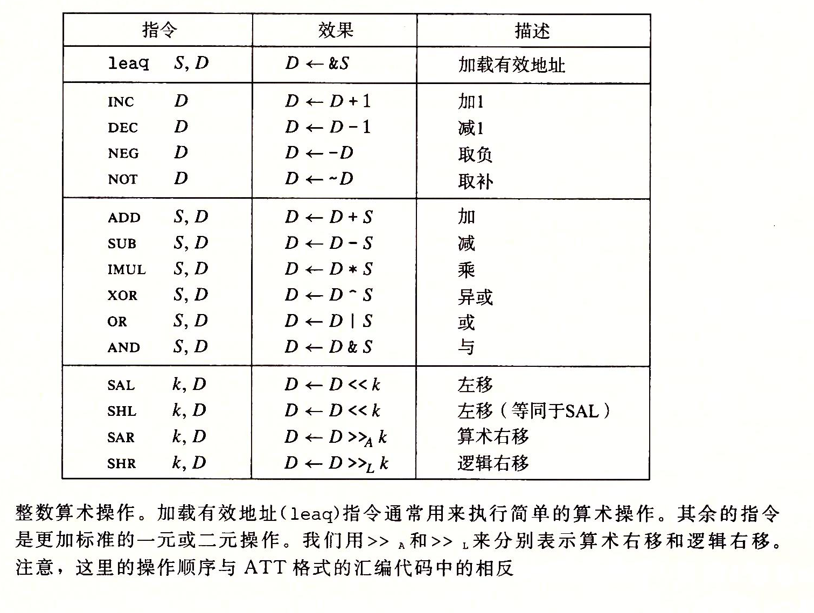

这一章主要讲了各种汇编的指令。基本要求是看懂, 理解汇编程序即可。不需要会写。

各种指令，mov，leaq，移位，运算，控制，条件传送指令
### 算术和逻辑操作

函数调用时帧栈结构 联合、结构数据分布和对齐的问题 内存越界和缓冲区溢出 64位

#### switch与if的区别
  空间换时间的思路

If else与switch对比：
switch直接跳转，时间复杂度是O(1)，if else最坏情况遍历所有可能性，复杂度是O(n)。switch的直接跳转原理是hash表，因此，如果case常量的种类很多时，汇编代码量也会比if else大很多
但是switch只能处理case为常量的情况，对非常量的情况是无能为力的。例如 if (a > 1 && a < 100)，是无法使用switch...case来处理的。对于这种情况，如果我们真的暴力的写case 1-case100. 代码块会很大
本质上是空间换时间
#### 栈的原理
  先入后出的原则，比如我的main函数调用func函数，在进入func前，会将一些寄存器的值保存下来，即压入栈中，然后在func中，可以放心使用这些寄存器
传参数6个以内，可以用register，那么程序的效率可以被提升
传指针，比传整个结构体要划算很多，因为传整个结构体，相当于(1)要生成相应的代码，将结构体的变量保存一份，这些代码的运行，需要消耗时间(2)这些变量会占用内存，占用空间
