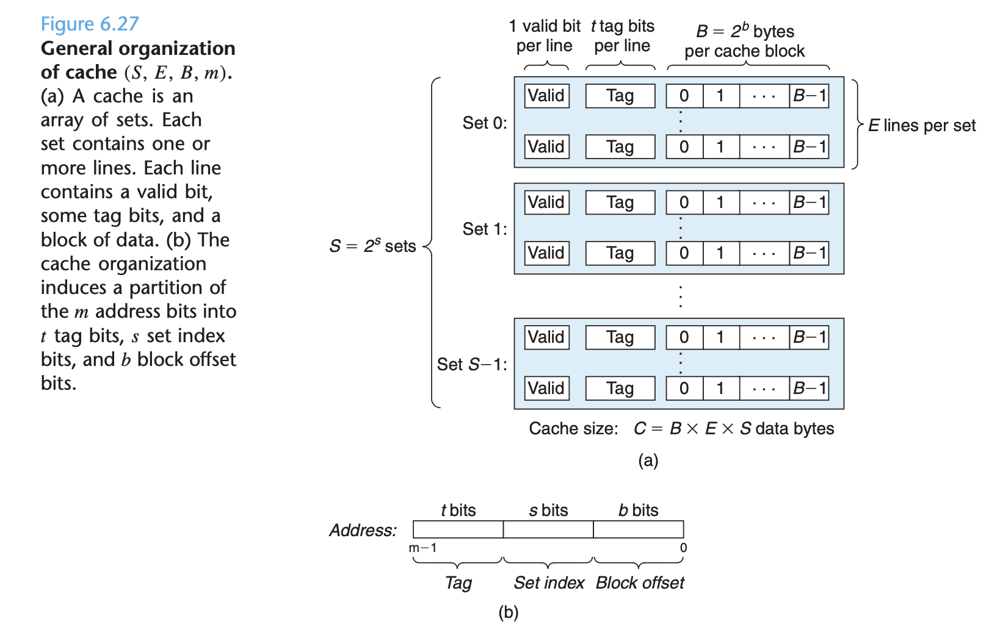
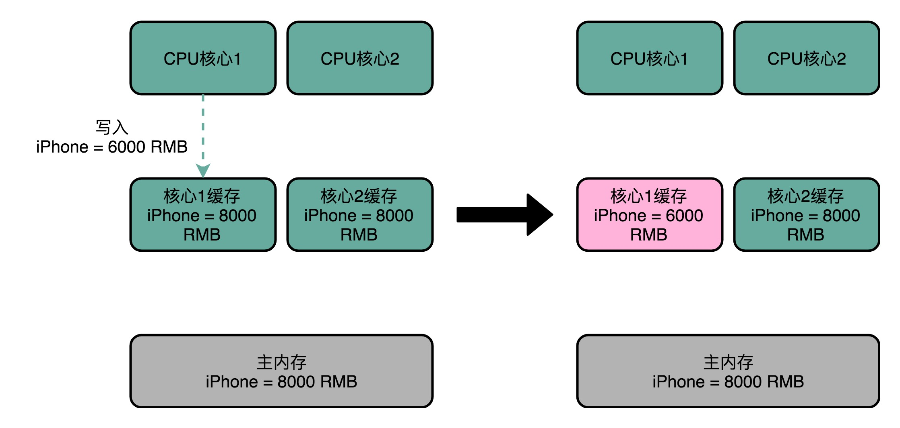

### 存储技术
从CPU发送可能回到下面几个地方取数据（从慢到快）：
1. 寄存器，0个周期
2. L1cache：SRAM组成，4个周期
3. L2cache：SRAM组成，10个周期
4. L3cache：SRAM组成，多核CPU共享，50个周期
5. 虚拟内存
6. 物理内存
7. 磁盘
8. 网络
其实在这里面充满cache，磁盘有磁盘缓存，网络请求也有缓存。

局部性原理也是利用的缓存，分为：
- 空间局部性：第一地址被读取，这个地址附近的地址数据也会被读取
- 时间局部性：一个地址读取，还有可能会被读取

### 高速缓存

在426页，多看看。

每个存储器地址有m位，形成M = 2^m个不同的地址。

一个机器的高速缓存有一下信息：
- S = 2^s个高速缓存组
- 每个组包含E = 个高速缓存行
- 每个行由一个B = 2^b字节数据块组成的，每行包含一下信息：
  + 1为有效位
  + t = m - (b + s)个标记位
  + B = 2^b字节的数据块

高速缓存由(S, E, B, m)组成。

以直接映射高速缓存为例：
1. CPU执行一条读内存字w的指令，这个指令包含m位，m = t + s + b
2. 组选择：通过s选择出对应高速缓存的哪一组
3. 行匹配：通过t匹配和组中的哪个行匹配 并且 这一行的有效为是1
4. 字选择：通过b寻找偏移量

### 存储器结构

#### SRAM和DRAM
SRAM需要的晶体管比较多，一个bit需要6～8个晶体管。相同的物理空间下，存储的数据有限，但是因为SRAM的电路简单所以访问速度快

DRAM存储一个bit只需要一个晶体管和一个电容即可，所以存储密度比较大。因为数据是存储在电容里面的，电容会不断漏电，所以需要定时刷新，这么来的动态。

DRAM的数据访问电路和刷新电路都比SRAM长，所以访问延时也比较长。

SRAM一般是CPU处理器使用，DRAM一般是内存使用。
#### L缓存
L1缓存的是每个CPU独占，分为指令缓存和数据缓存

L2缓存也是每个CPU独占，但是不在CPU的内部会满一些

L3是多核CPU共享的缓存

#### 举例：Intle i5-8265U

1. 每个核心有32K的cache，一共4 * 32 = 128K
2. 指令和数据cache采用8路组相连的放置策略
3. 每个核有256K的L2 cache，L2 cache采用4 路组相连的放置策略。
4. 一块多个核心共用的 12MB 的 L3 Cache，采用的是 12 路组相连的放置策略。

https://colin-scott.github.io/personal_website/research/interactive_latency.html

### 缓存

#### 高速缓存

当CPU请求一个地址的时候会发生如下过程：
1. 地址分为组标记 + 索引 + 偏移量
2. 通过地址索引找到高速缓存的哪一行
3. 判断高速缓存的有效位是否为1
4. 判断地址的组标记和高速缓存的组标记是否一直
5. 从偏移量开始读取一个字

#### 缓存一致性协议：MESI

CPU1向L2 cache写入了数据，但是CPU2不知道。这就是缓存不一致。

要实现缓存的一致性，需要遵循下面的两个原则：
1. 写传播：在CPU1上的写要同步到其他地方
2. 事务的串行化：CPU1修改data1为A，CPU2修改data1为B，那么CPUn和cpun+n读到的应该是一样的

总线嗅探：所有的读写请求通过总线广播给其他的CPU。

- M（modified）：已修改
- E（Exclusive）：独占
- S（Shared）：共享
- I（Invaidated）：已失效

[wiki](https://zh.wikipedia.org/wiki/MESI%E5%8D%8F%E8%AE%AE)

