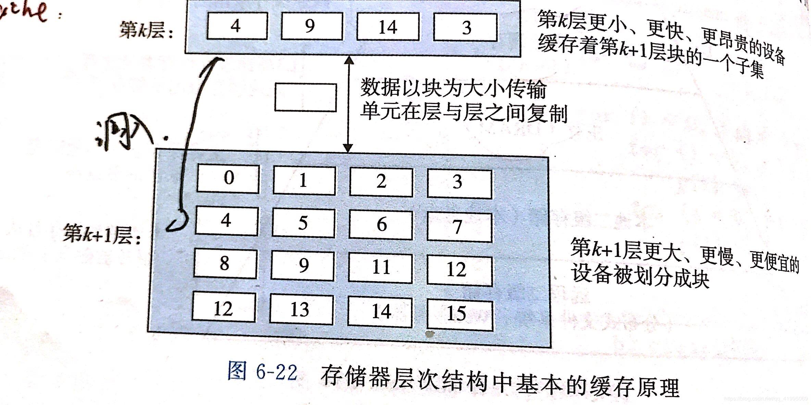

6.访问磁盘

内存映射技术：地址空间中一块地址是为与I/O设备通信保留的I/O端口，设备连接到总线时，与一个或多个端口相关联。

6.1 固态硬盘

SSD封装到I/O总线上标准硬盘插槽。一个SSD封装由一个或多个闪存芯片和闪存翻译层组成。闪存翻译层扮演磁盘控制器的

组成：由B个块的序列组成，每个块由P页组成，页的大小为512字节~4KB 块由32-128页组成，大小为16KB~512KB

数据以页为单位读写，只有在一页所属的块被擦除后，才可以写这一页、

随机写慢。-擦除需要时间较长 -写操作试图修改一个包含已经有的数据的页p，则这个块中所有带有数据的页都必须被复制到一个新的块，才能对p进行重写。

优点：1.没有移动的部件，所以随机访问时间比旋转磁盘快，能耗低。

缺点：SSD容易磨损。

 

6.2 局部性

时间局部性：被引用过一次的数据很可能在不远的将来被再次引用，是较好的时间局部性

空间局部性：一个内存位置被引用了，那么程序在不久的将来会引用其附近的一个内存位置。

局部性总结：1.重复引用相同变量的程序有良好的时间局部性。

                  2.对与具有步长为k的引用模式的程序，步长越小，空间局部性越好。

                  3.对于取指令来说，循环有好的时间和空间局部性。循环体越小，循环迭代次数越多，局部性越好。

6.3 存储器的层次结构

6.3.1 存储器层次结构中的缓存

存储器层次结构的中心思想：对于每个K,位于K蹭的更快更小的存储器设备作为位于K+1层的更大更慢的存储设备的缓存。层次结构中的每一层都缓存来自较低一层的数据对象。

存储器层析结构中缓存的一般性概念：K+1层的存储器被划分为连续的数据对象组块——块。每个块有唯一的地址或名字。

数据以块为传送单元，在K层与K+1层来回复制。

1. 缓存命中

当程序需要K+1层中的数据对象d中，在第K层的一个块中寻找d，若d存在缓存K层中，称为缓存命中。

2. 缓存不命中

第K层没有缓存数据对象d，则为缓存不命中。

此时第K层的缓存从K+1层中取出包含d的块，放入K层（若K层已满，则需覆盖一个块）。

牺牲块：被覆盖替换的现存块。

3. 缓存不命中的种类

强制性不命中/冷不命中 冷缓存（cold cache）：第K层缓存是空的，对任何数据对象的访问都不命中。

      发生不命中，K层必须采用严格的放置策略，确定K+1层的块放在K层何处。限制性放置策略确定k+1层的块放在k层的（i mod n）中。

冲突不命中：限制性放置策略引起的不命中。数据对象会映射到同一个缓存块，然后缓存会一直不命中。

容量不命中：每个阶段访问缓存块的某个相对稳定的集合。当工作集的大小超过缓存的大小，缓存会容量不命中。（缓存太小，不能处理工作集）

4. 缓存管理

存储器层次结构的本质：每一层存储设备都是较低一层的的缓存。

在一个虚拟内存的系统中，DRAM主存作为存储在磁盘上的数据块的缓存，由操作系统软件和CPU上的地址翻译硬件共同管理。
