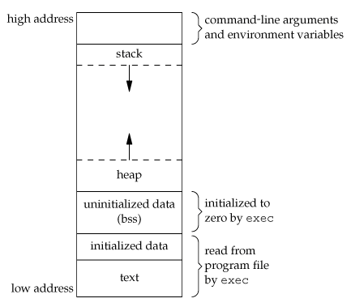

### 信号

Linux查看信号种类`kill -l`.


查看信号的解释`man 7 signal`


一旦信号产生，有下面三种操作：
- 执行默认操作
- 捕捉信号
- 忽略信号


信号处理还有有下面三种类别（sa_flags）：
- SA_ONESHOT：捕捉到信号之后只执行一次
- SA_NOMASK：当处理这个信号的时候来了其他信号，去处理其他信号
- SA_INTERRUPT，清除了SA_RESTART：在进行系统调用的时候，来了信号处理完了， 返回给应用一个错误码，让人家自己去搞
- SA_INTERRUPT，没有清除SA_RESTART：自动重启，但是有的时候比较尴尬，当用户输入的时候，系统调用处理字符的时候来了信号，再重启，还得让用户重新输入一遍

### 可靠信号和可靠信号

linux早期的信号是从unix继承过来的，32号一下的是不能排队的，只有32号以后才能排队，即不会丢失了。

```shell
# kill -l
 1) SIGHUP	 2) SIGINT	 3) SIGQUIT	 4) SIGILL	 5) SIGTRAP
 6) SIGABRT	 7) SIGBUS	 8) SIGFPE	 9) SIGKILL	10) SIGUSR1
11) SIGSEGV	12) SIGUSR2	13) SIGPIPE	14) SIGALRM	15) SIGTERM
16) SIGSTKFLT	17) SIGCHLD	18) SIGCONT	19) SIGSTOP	20) SIGTSTP
21) SIGTTIN	22) SIGTTOU	23) SIGURG	24) SIGXCPU	25) SIGXFSZ
26) SIGVTALRM	27) SIGPROF	28) SIGWINCH	29) SIGIO	30) SIGPWR
31) SIGSYS	34) SIGRTMIN	35) SIGRTMIN+1	36) SIGRTMIN+2	37) SIGRTMIN+3
38) SIGRTMIN+4	39) SIGRTMIN+5	40) SIGRTMIN+6	41) SIGRTMIN+7	42) SIGRTMIN+8
43) SIGRTMIN+9	44) SIGRTMIN+10	45) SIGRTMIN+11	46) SIGRTMIN+12	47) SIGRTMIN+13
48) SIGRTMIN+14	49) SIGRTMIN+15	50) SIGRTMAX-14	51) SIGRTMAX-13	52) SIGRTMAX-12
53) SIGRTMAX-11	54) SIGRTMAX-10	55) SIGRTMAX-9	56) SIGRTMAX-8	57) SIGRTMAX-7
58) SIGRTMAX-6	59) SIGRTMAX-5	60) SIGRTMAX-4	61) SIGRTMAX-3	62) SIGRTMAX-2
63) SIGRTMAX-1	64) SIGRTMAX
```
[signal.c](./code/signal.c)

编译`gcc signal.c`
开两个终端：
第一个终端执行：
```shell
# ./a.out
My PID is 8386
```
然后第二个终端连续发三个`kill -SIGUSR1 8386`


观察第一个终端的变化：
```shell
# ./a.out
My PID is 8386
SIGUSR1 received
SIGUSR1 received
read is interrupted by signal

```

我们发现丢了一个，这个很正常，符合我们的认知。

当我们把程序改为59号，也就是SIGRTMAX-5信号，看看

[signal-59.c](./code/signal-59.c)

第一个终端执行：
```shell
# ./a.out
My PID is 14232
```

然后第二个终端连续发三个`kill -SIGRTMAX-5 14232`

观察第一个终端的变化：
```shell
# ./a.out
My PID is 14232
SIGRTMAX-5 received
SIGRTMAX-5 received
SIGRTMAX-5 received
read is interrupted by signal
```

### 虚拟内存

内存表示：


栈在上面，地址向下“增长”；堆在下面，地址向上增长。

```shell
 pmap 21939
21939:   ./loop
000055c1e4bfd000      4K r-x-- loop
000055c1e4dfd000      4K r---- loop
000055c1e4dfe000      4K rw--- loop
000055c1e6781000    132K rw---   [ anon ]
00007ff1130d6000   1948K r-x-- libc-2.27.so
00007ff1132bd000   2048K ----- libc-2.27.so
00007ff1134bd000     16K r---- libc-2.27.so
00007ff1134c1000      8K rw--- libc-2.27.so
00007ff1134c3000     16K rw---   [ anon ]
00007ff1134c7000    156K r-x-- ld-2.27.so
00007ff1136e4000      8K rw---   [ anon ]
00007ff1136ee000      4K r---- ld-2.27.so
00007ff1136ef000      4K rw--- ld-2.27.so
00007ff1136f0000      4K rw---   [ anon ]
00007ffc46dc3000    132K rw---   [ stack ]
00007ffc46de8000     12K r----   [ anon ]
00007ffc46deb000      8K r-x--   [ anon ]
ffffffffff600000      4K r-x--   [ anon ]
 total             4512K
```

```shell
# cat /proc/21939/m
map_files/  maps        mem         mountinfo   mounts      mountstats
root@iZ8vbaym9jmge8qd5hlcpiZ:~# cat /proc/21939/maps
55c1e4bfd000-55c1e4bfe000 r-xp 00000000 fc:01 1334149                    /root/linux-c/loop
55c1e4dfd000-55c1e4dfe000 r--p 00000000 fc:01 1334149                    /root/linux-c/loop
55c1e4dfe000-55c1e4dff000 rw-p 00001000 fc:01 1334149                    /root/linux-c/loop
55c1e6781000-55c1e67a2000 rw-p 00000000 00:00 0                          [heap]
7ff1130d6000-7ff1132bd000 r-xp 00000000 fc:01 1188167                    /lib/x86_64-linux-gnu/libc-2.27.so
7ff1132bd000-7ff1134bd000 ---p 001e7000 fc:01 1188167                    /lib/x86_64-linux-gnu/libc-2.27.so
7ff1134bd000-7ff1134c1000 r--p 001e7000 fc:01 1188167                    /lib/x86_64-linux-gnu/libc-2.27.so
7ff1134c1000-7ff1134c3000 rw-p 001eb000 fc:01 1188167                    /lib/x86_64-linux-gnu/libc-2.27.so
7ff1134c3000-7ff1134c7000 rw-p 00000000 00:00 0
7ff1134c7000-7ff1134ee000 r-xp 00000000 fc:01 1188163                    /lib/x86_64-linux-gnu/ld-2.27.so
7ff1136e4000-7ff1136e6000 rw-p 00000000 00:00 0
7ff1136ee000-7ff1136ef000 r--p 00027000 fc:01 1188163                    /lib/x86_64-linux-gnu/ld-2.27.so
7ff1136ef000-7ff1136f0000 rw-p 00028000 fc:01 1188163                    /lib/x86_64-linux-gnu/ld-2.27.so
7ff1136f0000-7ff1136f1000 rw-p 00000000 00:00 0
7ffc46dc3000-7ffc46de4000 rw-p 00000000 00:00 0                          [stack]
7ffc46de8000-7ffc46deb000 r--p 00000000 00:00 0                          [vvar]
7ffc46deb000-7ffc46ded000 r-xp 00000000 00:00 0                          [vdso]
ffffffffff600000-ffffffffff601000 r-xp 00000000 00:00 0                  [vsyscall]
```

32位的内存分页如下：


32位用两个页就够了


