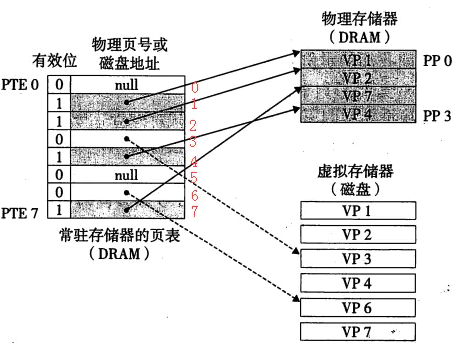
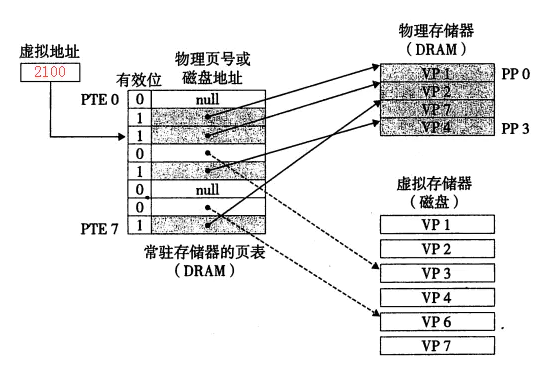
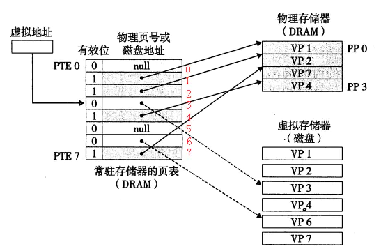

### 虚拟内存

虚拟存储器又叫做虚拟内存，我们现在的操作系统普遍都支持了虚拟内存，这样做是因为我们同时运行着太多的程序了，如果不使用虚拟内存4G的内存空间很快就会被耗尽，而一旦没有了内存空间，其他程序就无法加载了。虚拟内存的出现就是为了解决这个问题，当一个程序开始运行的时候，其实是为每个程序单独创建了一个页表（这个以后讲），只将一部分放入内存中，以后根据实际的需要随时从硬盘中调入内容。当然虚拟内存不仅仅只有这个功能，我们的操作系统也是在内存中运行着的，虚拟内存同时还提供了一种保护，这样做其他进程就不会损坏掉系统的内存空间。

虚拟存储器的主要思想就是：在主存中缓存硬盘上的虚拟页（pagefile.sys），虚拟页有三个状态：未分配、缓存的、未缓存的。

① 页表

页表是一个存放在内存中的数据结构，MMU就是通过页表来完成虚拟地址到物理地址的转换。这个数据结构每一个条目称为PTE（Page Table Entry），由两部分组成：有效位和n位地址段。有效位如果是1，那么n位地址就指向已经在内存中缓存好了的地址；如果为0，地址为null的话表示为分配，地址指向磁盘上的虚拟内存（pagefile.sys）的话就是未缓存。我们来看一个典型的页表图：

虚拟页vp1,2,7,4当前被缓存在内存中，页表上有效位设置成1，分别用PTE1，2，4，7表示。VP0和VP5（PTE0、5）未被分配，VP3和VP6被分配并指向虚拟内存，但未被缓存。

② 页命中

当我们使用2100虚拟地址来访问虚拟页2的内容的时候，就是一个页命中。地址翻译将指向PTE2上，由于有效位1，地址翻译器MMU就知道VP2已经缓存在内存中了。就使用页表中保存的物理地址进行访问。

③ 缺页

我们再来看看不命中，也就是缺页的情况，当CPU需要VP3的一个字时，初始化是这样的：

PTE3有效位是0，同时地址位指向了虚拟内存（pagefile.sys），就会触发缺页异常。异常处理程序会选择牺牲一个内存（DRAM）中的页，本例中选择的是内存中的PP3页的VP4，接下来内核就从虚拟内存中拷贝VP3到内存中的PP3，并使得PTE3指向内存中的PP3，形成如下：

（注：虚拟存储器出现早于高速缓存，按照习惯的说法块被叫做页。从虚拟内存到物理内存传送页的活动就叫做页面交换。）
